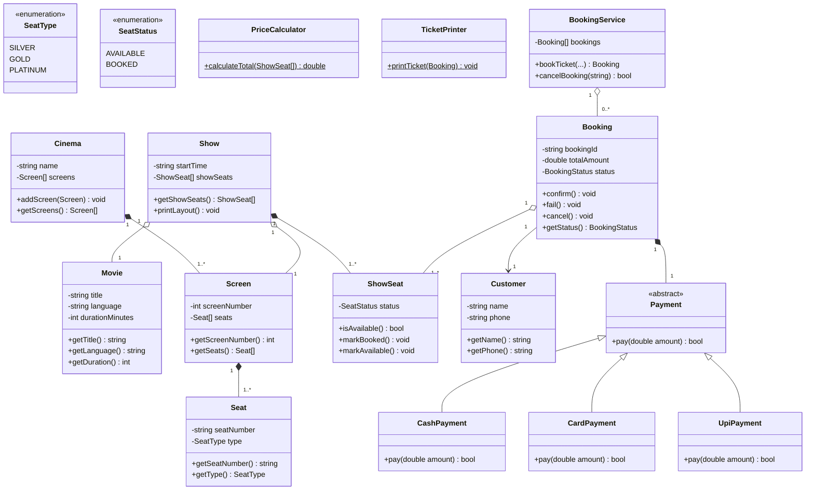
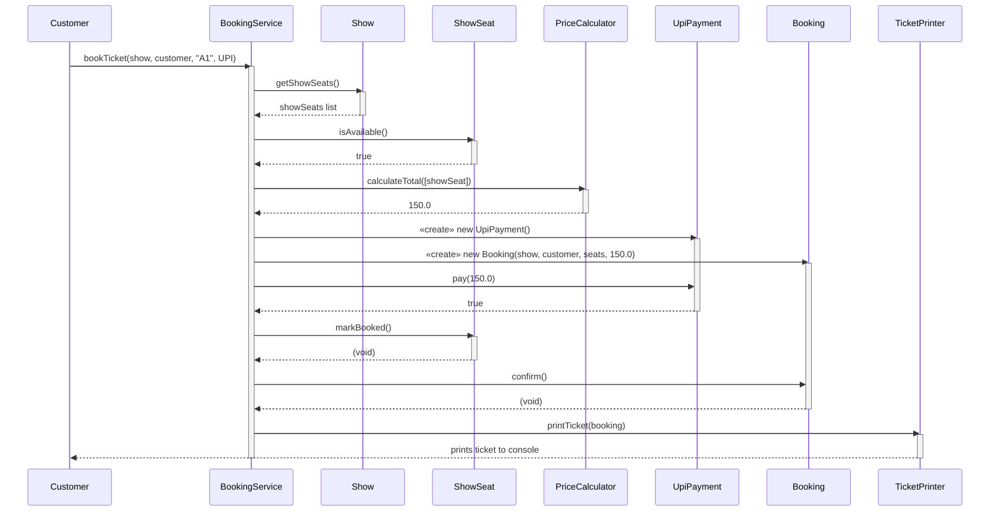

# TCS-504 — Assignment 1: Movie Ticket Booking System

---

## A. Requirement Analysis

### Functional Requirements

**FR1 — Movie listing:** The system shall display all movies currently playing, showing title, language, and duration, when the customer selects the "Movies" menu option.

**FR2 — Show listing:** For a movie selected by the customer, the system shall display all shows for that movie, including screen number and start time.

**FR3 — Seat layout:** For a show selected by the customer, the system shall display every seat's number, type, and current status (AVAILABLE or BOOKED), grouped by seat type.

**FR4 — Booking:** *(given)* A customer selects one or more seat numbers for a show. If any selected seat is already BOOKED, the whole booking is rejected and no seat changes state. Booking is confirmed only after payment succeeds.

**FR5 — Pricing:** The system shall calculate the total booking amount by summing each selected seat's price according to its type (SILVER ₹150, GOLD ₹250, PLATINUM ₹400).

**FR6 — Payment:** *(given)* Exactly one method (UPI / Card / Cash) per booking. If payment fails, seats are released and booking status becomes FAILED.

**FR7 — Ticket printing:** After a booking is confirmed, the system shall print a ticket containing booking id, movie name, screen number, show time, seat numbers, and total amount.

**FR8 — Cancellation:** The system shall allow a customer to cancel a CONFIRMED booking by booking id; upon cancellation, all seats in that booking shall revert to AVAILABLE and the booking status shall become CANCELLED.

### Non-Functional Requirements

**NFR1 — Modularity:** Each class shall reside in its own file, with a single well-defined responsibility, so that a class can be modified without requiring changes to unrelated classes.

**NFR2 — Extensibility:** Adding a new payment method (e.g., NetBanking) shall require creating exactly one new class that extends `Payment`, without modifying `BookingService`, `Booking`, or any existing `Payment` subclass.

**NFR3 — Input validation:** The system shall validate all user input (menu choices, seat numbers, movie/show selection) and shall not crash on invalid input; it shall display a clear error message and allow the user to retry instead.

**NFR4 — State consistency:** A seat's AVAILABLE/BOOKED status shall change only when a booking is fully confirmed (payment succeeded) or fully cancelled — there shall be no partially-booked state visible to other customers.

---

## B. Noun–Verb Analysis

| Noun found | Keep as a class? | Reason |
|---|---|---|
| Movie | yes | has its own data and identity |
| Seat | yes | has number, type, price |
| "seat layout" | no | it is a view of a Show's seats, not a thing → a print method |
| Screen | yes | has its own identity (screen number), owns seats |
| Cinema | yes | has identity (name), owns screens |
| Show | yes | represents one screening (movie + screen + time), owns per-show seat state |
| Customer | yes | has identity (name, phone), referenced by bookings |
| Booking | yes | has its own id, status, seats and amount — a real transactional entity |
| Payment | yes (abstract) | represents "how" payment happens; behavior varies by method → base for polymorphism |
| UPI / Card / Cash | yes (as subclasses) | each has genuinely different `pay()` behavior → `UpiPayment`, `CardPayment`, `CashPayment` |
| Ticket | no | it is the *printed output* of a booking, not a stored entity → `TicketPrinter.printTicket()` |
| "booking id" | no | an attribute of `Booking`, not its own class |
| "seat status" | no | an attribute of `ShowSeat`, not its own class |
| "total amount" / price | no | a computed value → `PriceCalculator` method, not a class |

**Verbs found → methods:** list, display, book, pay, print, cancel, calculate → these map directly to methods on the classes above (`listMovies()`, `bookTicket()`, `pay()`, `printTicket()`, `cancelBooking()`, `calculateTotal()`).

---

## C. Relationship Table (with justification — lifetime test)

| Pair | Choice | Justification |
|---|---|---|
| Cinema — Screen | **Composition (◆)** | If the Cinema is destroyed, its Screens have no independent existence — a screen only exists as part of one specific building. |
| Screen — Seat | **Composition (◆)** | If a Screen is torn down, its physical seats go with it — seats don't exist independently of their screen. |
| Show — Movie | **Aggregation (◇)** *(given)* | A Show *borrows* a Movie. Cancel the 6 PM show and "3 Idiots" still exists and still plays at 9 PM. |
| Show — Screen | **Aggregation (◇)** | A Show *borrows* a Screen for a time slot; the Screen keeps existing (and hosts other shows) after this Show ends. |
| Show — ShowSeat | **Composition (◆)** | `ShowSeat` represents this show's per-seat status and has no meaning outside this Show; delete the Show and its ShowSeats are deleted too. |
| Booking — Customer | **Association** | A Booking references a Customer, but neither owns the other's lifecycle — a Customer exists with or without any particular booking. |
| Booking — ShowSeat | **Aggregation (◇)** | A Booking references *existing* ShowSeats borrowed from the Show. If the Booking is cancelled, the ShowSeats aren't destroyed — they just revert to AVAILABLE. |
| Booking — Payment | **Composition (◆)** | A `Payment` object is created solely to carry out one booking's transaction and is discarded once that transaction ends — it has no purpose or existence outside that Booking. |
| Payment — UpiPayment | **Inheritance** | `UpiPayment` **is a** `Payment` — it inherits the `pay()` contract and supplies its own implementation. |
| BookingService — Booking | **Aggregation (◇)** | `BookingService` creates and holds Bookings while running, but a Booking is a business record that could be handed off/persisted independently of this particular service instance — destroying the service doesn't conceptually destroy the booking record. |

---

## D. Class Diagram



*(Paste this block into [mermaid.live](https://mermaid.live) to export a clean PNG/SVG for submission, or redraw by hand/draw.io using the same classes, visibility markers, and multiplicities shown above.)*

---

## E. Sequence Diagram — "Customer books 1 seat and pays by UPI"



---

## F. Modular Working Code

See the accompanying `.cpp` files (`01_Movie.cpp` through `13_BookingService.cpp`, plus `main.cpp`). One class per file, no header files — classes are `#include`d directly, in dependency order, from `main.cpp`.

**To compile and run:**
```bash
g++ -std=c++17 main.cpp -o movie_booking
./movie_booking
```

---

## G. SOLID Mapping + Deliberate Omission

**Single Responsibility Principle (SRP):** `Booking` does **not** print tickets. Printing is entirely `TicketPrinter`'s job. A change to *how a ticket looks* never touches `Booking`, and a change to *pricing rules* never touches `TicketPrinter` — each class has exactly one reason to change.

**Open/Closed Principle (OCP):** Adding `NetBankingPayment` requires writing **one new class** that extends `Payment`. `BookingService` depends only on the abstract `Payment` type (`payment->pay(amount)`), so no existing class needs to be edited to support the new method.

**Liskov Substitution Principle (LSP):** `UpiPayment`, `CardPayment`, and `CashPayment` can each be used anywhere a `Payment*` is expected, with no extra setup calls or special-casing in `BookingService` — `payment->pay(total)` behaves consistently regardless of which concrete subclass is plugged in.

**One thing deliberately NOT done:** We did **not** persist bookings, shows, or seat state to a file or database — everything lives in memory for the lifetime of the program, and restarting the app resets all bookings. This was a deliberate scope decision: this assignment is about OOP design (encapsulation, correct relationships, polymorphism), not persistence/storage design, so adding file I/O or a DB layer would add implementation weight without adding any design value to what's being assessed.

---

## Edge Cases Handled in the Demo

1. Booking an already-BOOKED seat → rejected, no state changes (`bookTicket` checks `isAvailable()` before touching anything).
2. A failed payment → booking marked `FAILED`, seats never marked booked.
3. Cancelling a booking → its seats revert to `AVAILABLE` via `cancelBooking()`.
4. Invalid seat number or menu choice → a clear message is printed; the program does not crash (checked with `findShowSeat` returning `nullptr` and an `else` branch on the menu switch).
